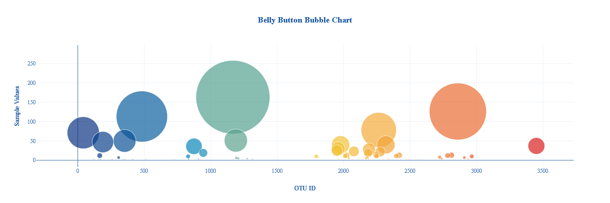

# Plot.ly Homework - Belly Button Biodiversity

In this Homework, an interactive dashboard to explore the Belly Button Biodiversity dataset[Belly Button Biodiversity dataset](http://robdunnlab.com/projects/belly-button-biodiversity/) is built, which catalogs the microbes that colonize human navels.

The dataset reveals that a small handful of microbial species (also called operational taxonomic units, or OTUs, in the study) were present in more than 70% of people, while the rest were relatively rare.

## Step 1: Plotly

1. Used the D3 library to read in `samples.json`.  Used the HTTP to read in data.

2. Created a horizontal bar chart with a dropdown menu to display the top 10 OTUs found in that individual.

* Used `sample_values` as the values for the bar chart.

* Used `otu_ids` as the labels for the bar chart.

* Used `otu_labels` as the hovertext for the chart.

  

3. Create a bubble chart that displays each sample.

* Used `otu_ids` for the x values.

* Used `sample_values` for the y values.

* Used `sample_values` for the marker size.

* Use `otu_ids` for the marker colors.

* Used `otu_labels` for the text values.

4. Displaedy the sample metadata, i.e., an individual's demographic information.

5. Displayed each key-value pair from the metadata JSON object somewhere on the page.

6. Update all of the plots any time that a new sample is selected.

Additionally, you are welcome to create any layout that you would like for your dashboard. An example dashboard is shown below:

## Advanced Challenge Assignment (Optional)

The following task is advanced and therefore optional.

* Adapted the Gauge Chart from <https://plot.ly/javascript/gauge-charts/> to plot the weekly washing frequency of the individual.

* Modified the example gauge code to account for values ranging from 0 through 9.

* Updated the chart whenever a new sample is selected.

## Deployment

* Deploy the app to GitHub Pages and submitted the links
* Ensure your repository has regular commits and a thorough README.md file

## Tools Used
Plot.ly
JS
HTML
CSS
Json
D3.js
console.log
GitHub and GitHub Pages

## References
* [Plotly.js documentation](https://plot.ly/javascript/) when building the plots.
Hulcr, J. et al.(2012) _A Jungle in There: Bacteria in Belly Buttons are Highly Diverse, but Predictable_. Retrieved from: [http://robdunnlab.com/projects/belly-button-biodiversity/results-and-data/](http://robdunnlab.com/projects/belly-button-biodiversity/results-and-data/)
